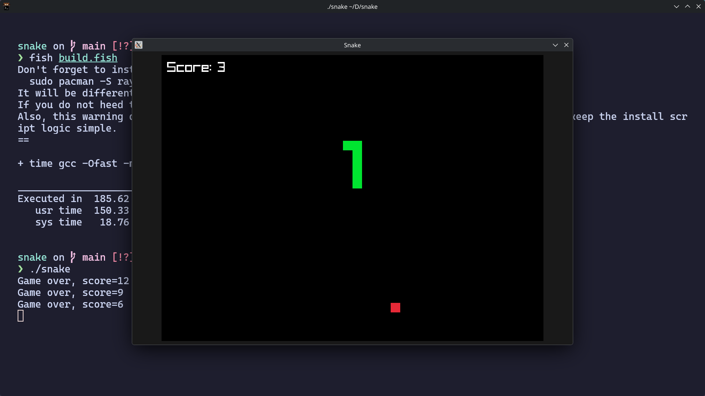

# Snake-c 1.0.3

## What's this?
It's a snake game made in C using the raylib library. It is not perfect by any means but I made it as a base for another project, but then, right before adding the AI reinforcement learning to automate the snake, I thought, well, it's a pretty neat program already and people might like it, so I made a repo for it.

## Who are you
My handle is willmil11, I'm a 15yo self taught french developer (and, yes, I would automate updating this number if markdown let me).

## How to run?
I only tested on my machine (arch linux laptop with amd igpu), but, it should be able to compile anywhere as long as you heed the warning build.fish displays every time you build which is that you need to install raylib. As the script says, on arch linux, you just need to run `sudo pacman -S raylib`.

After that you can just run `fish build.fish`.

If you don't heed the warning the build will fail in the case that raylib is not installed.

Usually I would say you need fish (because it's a fish script) but here it's so simple that any shell will do (and no, you don't need to change the file extension, just `fish/bash/zsh/sh/dash/whatever build.fish`)

## Why isn't the logic optimized?
Because eh, works well enough. Besides as I said this program isn't meant to be perfect by any means.

## Was AI involved in the creation of this program?
No.

## Version history
- 1.0.3: Do you like when your simple snake game uses 100% cpu single core? No?.. Me neither, so I fixed it.
- 1.0.2: Fixed another readme problem. Maybe I should invest some effort in installing a markdown renderer to see how it would look before pushing to main?.. Or not.
- 1.0.1: Fixed problems in the README and added a screenshot.
- 1.0.0: Initial release.

## License
Click [here](./LICENSE) to open the license.
